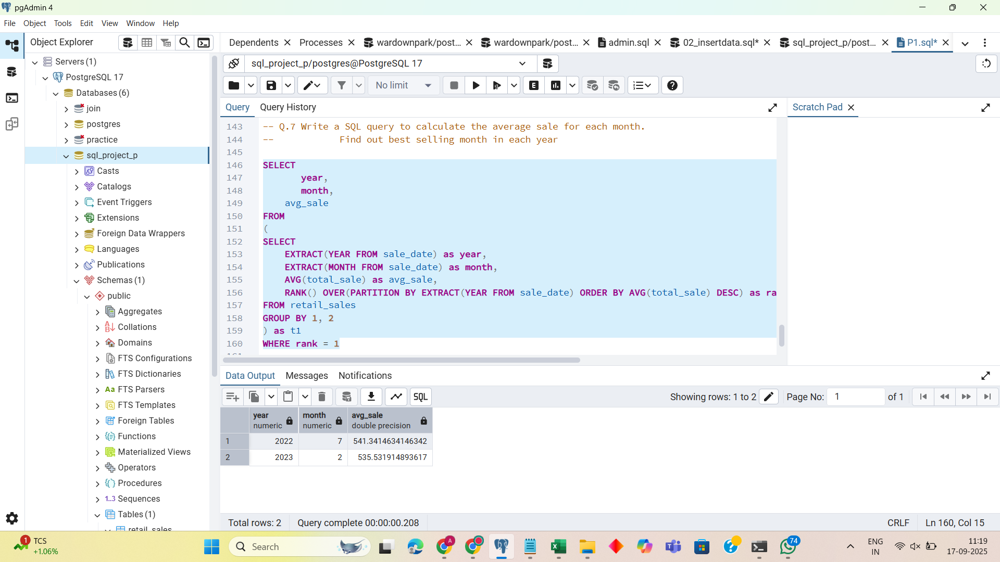

# Retail Sales Analysis SQL Project

## Project Overview

**Project Title**: Retail Sales Analysis  
**Level**: Beginner  
**Database**: `p1_retail_db`

This project is designed to demonstrate SQL skills and techniques typically used by data analysts to explore, clean, and analyze retail sales data. The project involves setting up a retail sales database, performing exploratory data analysis (EDA), and answering specific business questions through SQL queries.

## Objectives

1. **Set up a retail sales database**: Create and populate a retail sales database with the provided sales data.
2. **Data Cleaning**: Identify and remove any records with missing or null values.
3. **Exploratory Data Analysis (EDA)**: Perform basic exploratory data analysis to understand the dataset.
4. **Business Analysis**: Use SQL to answer specific business questions and derive insights from the sales data.

## Project Structure

### 1. Database Setup

- **Database Creation**: The project starts by creating a database named `p1_retail_db`.
- **Table Creation**: A table named `retail_sales` is created to store the sales data. The table structure includes columns for transaction ID, sale date, sale time, customer ID, gender, age, product category, quantity sold, price per unit, cost of goods sold (COGS), and total sale amount.

```sql
CREATE DATABASE p1_retail_db;

CREATE TABLE retail_sales
CREATE TABLE retail_sales(
transactions_id INT PRIMARY KEY,
sale_date DATE,
sale_time TIME,
customer_id	INT,
gender VARCHAR(10),
age	INT,
category VARCHAR(15),
quantiy INT,
price_per_unit FLOAT,
cogs FLOAT,
total_sale FLOAT
);
```

### 2. Data Exploration & Cleaning

- **Correcting Colum  name**: Renaming column 'quantiy' to 'quantity'
- **Record Count**: Determine the total number of records in the dataset.
- **Customer Count**: Find out how many unique customers are in the dataset.
- **Category Count**: Identify all unique product categories in the dataset.
- **Null Value Check**: Check for any null values in the dataset and delete records with missing data.

```sql
ALTER TABLE retail_sales
RENAME COLUMN quantiy TO quantity;

SELECT COUNT(*) FROM retail_sales;
SELECT COUNT(DISTINCT customer_id) FROM retail_sales;
SELECT DISTINCT category FROM retail_sales;

SELECT * FROM retail_sales
WHERE 
     transactions_id IS NULL
	 OR 
	 sale_date IS NULL
	 OR 
	 sale_time IS NULL
	 OR 
	 customer_id IS NULL
	 OR 
	 gender	IS NULL
	 OR 
	 age IS NULL
	 OR
	 category IS NULL
	 OR 
	 quantiy	IS NULL
	 OR
	 price_per_unit IS NULL
	 OR
	 cogs 
	 IS NULL
	 OR 
	 total_sale IS NULL
;

DELETE FROM retail_sales
WHERE
transactions_id IS NULL
	 OR 
	 sale_date IS NULL
	 OR 
	 sale_time IS NULL
	 OR 
	 customer_id IS NULL
	 OR 
	 gender	IS NULL
	 OR 
	 age IS NULL
	 OR
	 category IS NULL
	 OR 
	 quantiy	IS NULL
	 OR
	 price_per_unit IS NULL
	 OR
	 cogs 
	 IS NULL
	 OR 
	 total_sale IS NULL ;

```

### 3. Data Analysis & Findings

The following SQL queries were developed to answer specific business questions:

1. **Write a SQL query to retrieve all columns for sales made on '2022-11-05'**:
```sql
SELECT * FROM retail_sales
WHERE sale_date = '2022-11-05';
```

2. **Write a SQL query to retrieve all transactions where the category is 'Clothing' and the quantity sold is more than 3 in the month of Nov-2022**:
```sql
SELECT * FROM retail_sales
WHERE 
     category = 'Clothing'
	 AND
	 quantity > 3
	 AND 
	 TO_CHAR(sale_date, 'YYYY-MM') = '2022-11';
```

3. **Write a SQL query to calculate the total sales (total_sale) for each category.**:
```sql
SELECT
      category,
	  SUM(total_sale) AS net_sale
FROM retail_sales
GROUP BY category;
```

4. **Write a SQL query to find the average age of customers who purchased items from the 'Beauty' category.**:
```sql
SELECT
ROUND(AVG(age),2) AS average_age FROM retail_sales
WHERE category = 'Beauty';
```

5. **Write a SQL query to find all transactions where the total_sale is greater than 1000.**:
```sql
SELECT * FROM retail_sales
WHERE total_sale > 1000;
```

6. **Write a SQL query to find the total number of transactions (transaction_id) made by each gender in each category.**:
```sql
SELECT gender, category, COUNT(transactions_id) AS total_transactions FROM retail_sales
GROUP BY gender, category
ORDER BY gender, category;
```

7. **Write a SQL query to calculate the average sale for each month. Find out best selling month in each year**:
```sql
SELECT 
       year,
       month,
    avg_sale
FROM 
(    
SELECT 
    EXTRACT(YEAR FROM sale_date) as year,
    EXTRACT(MONTH FROM sale_date) as month,
    AVG(total_sale) as avg_sale,
    RANK() OVER(PARTITION BY EXTRACT(YEAR FROM sale_date) ORDER BY AVG(total_sale) DESC) as rank
FROM retail_sales
GROUP BY 1, 2
) as t1
WHERE rank = 1
```

8.**Write a SQL query to find the top 5 customers based on the highest total sales**:
```sql
SELECT customer_id, SUM(total_sale) AS total_sales
FROM retail_sales
GROUP BY customer_id
ORDER BY total_sales DESC
LIMIT 5;
```

9. **Write a SQL query to find the number of unique customers who purchased items from each category.**:
```sql
SELECT 
    category,
    COUNT(DISTINCT customer_id) AS unique_customers
FROM retail_sales
GROUP BY category;
```

## Findings

- **Customer Demographics**: The dataset includes customers from various age groups, with sales distributed across different categories such as Clothing and Beauty.
- **High-Value Transactions**: Several transactions had a total sale amount greater than 1000, indicating premium purchases.
- **Sales Trends**: Monthly analysis shows variations in sales, helping identify peak seasons.
- **Customer Insights**: The analysis identifies the top-spending customers and the most popular product categories.

## Reports

- **Sales Summary**: A detailed report summarizing total sales, customer demographics, and category performance.
- **Trend Analysis**: Insights into sales trends across different months and shifts.
- **Customer Insights**: Reports on top customers and unique customer counts per category.

## Conclusion

This project showcases core SQL skills by building a retail sales database, cleaning data, and answering key business questions. Insights include sales trends by category, top customers, and high-value transactions, demonstrating essential data filtering, aggregation, and analysis techniques.

## How to Use

1. **Clone or download** this repo    git clone https://github.com/amanbhartiprism/sql_retail_sales.git
   
2. **Create database**  
- Open pgAdmin (or your SQL tool)  
- Create a new database named `p1_retail_db`

3. **Run table script**  
- Open `P1.sql`  
- Execute the `CREATE TABLE` block to create `retail_sales`

4. **Import data**  
- In your SQL tool, choose “Import” on `retail_sales`  
- Select `SQL-Retail-Sales-Analysis_utf.csv`  
- Map columns and import

5. **Execute analysis queries**  
- Copy each query from `P1.sql` (after data import)  
- Run them one by one to view results

6. **Explore & modify**  
- Use provided queries to understand sales trends  
- Change filters or groupings to ask new questions  

## Question Screenshots





## Author - Aman Bharti
- **LinkedIn**: linkedin.com/in/aman-bharti-aa443b312


Thank you


